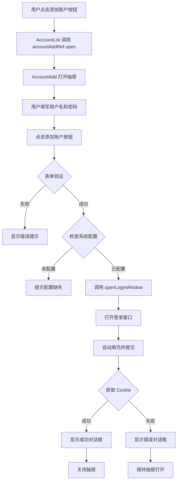

# AccountAdd 组件重构文档

## 概述

将 [`AccountList.vue`](../src/renderer/src/components/AccountList.vue) 中的添加账户抽屉功能提取到独立的 [`AccountAdd.vue`](../src/renderer/src/components/AccountAdd.vue) 组件中，并整合了从系统配置读取登录地址和默认脚本的功能。

## 重构内容

### 1. AccountAdd.vue 组件功能

**核心功能：**

- ✅ 独立的添加账户抽屉组件
- ✅ 表单验证（用户名、密码必填）
- ✅ 从系统配置读取登录地址
- ✅ 从系统配置读取默认执行脚本
- ✅ 调用登录窗口服务获取 Cookie
- ✅ 使用 Electron 原生对话框显示结果
- ✅ 通过 `ref` 暴露 `open()` 和 `close()` 方法

**组件接口：**

```typescript
// 暴露的方法
interface AccountAddExpose {
  open: () => void // 打开抽屉
  close: () => void // 关闭抽屉
}
```

**使用方式：**

```vue
<script setup lang="ts">
import { ref } from 'vue'
import AccountAdd from './AccountAdd.vue'

const accountAddRef = ref<InstanceType<typeof AccountAdd>>()

const openAddDrawer = () => {
  accountAddRef.value?.open()
}
</script>

<template>
  <Button @click="openAddDrawer">添加账户</Button>
  <AccountAdd ref="accountAddRef" />
</template>
```

### 2. AccountList.vue 组件简化

**移除的内容：**

- ❌ 抽屉状态管理 (`isDrawerOpen`)
- ❌ 表单数据 (`newAccount`)
- ❌ 表单错误 (`formErrors`)
- ❌ 表单验证逻辑 (`validateForm`)
- ❌ 添加账户逻辑 (`handleAddAccount`)
- ❌ 抽屉模板代码

**保留的内容：**

- ✅ 账户列表展示
- ✅ 监控状态管理
- ✅ 操作按钮（开始、暂停、更新凭证、删除）
- ✅ 刷新列表功能

**新增的内容：**

- ✅ 引用 `AccountAdd` 组件
- ✅ 通过 `ref` 调用 `open()` 方法

## 代码对比

### 之前（AccountList.vue 包含所有逻辑）

```vue
<script setup>
// 475 行代码
// 包含列表展示 + 添加账户逻辑
const isDrawerOpen = ref(false)
const newAccount = ref({ username: '', password: '' })
const formErrors = ref({ username: '', password: '' })

const validateForm = () => {
  /* ... */
}
const handleAddAccount = async () => {
  /* ... */
}
</script>

<template>
  <Card><!-- 列表 --></Card>
  <Drawer><!-- 添加账户表单 --></Drawer>
</template>
```

### 之后（分离为两个组件）

**AccountList.vue (267 行)**

```vue
<script setup>
// 只负责列表展示和操作
import AccountAdd from './AccountAdd.vue'

const accountAddRef = ref<InstanceType<typeof AccountAdd>>()
const openAddDrawer = () => accountAddRef.value?.open()
</script>

<template>
  <Card><!-- 列表 --></Card>
  <AccountAdd ref="accountAddRef" />
</template>
```

**AccountAdd.vue (213 行)**

```vue
<script setup>
// 只负责添加账户
import { ConfigStore } from '@/stores/config'

const isDrawerOpen = ref(false)
const config = (ref < SystemConfig) | (null > null)

const open = () => {
  isDrawerOpen.value = true
}
const close = () => {
  isDrawerOpen.value = false
}

defineExpose({ open, close })
</script>

<template>
  <Drawer v-model:open="isDrawerOpen">
    <!-- 添加账户表单 -->
  </Drawer>
</template>
```

## 功能流程

### 添加账户完整流程



## 集成的配置读取功能

### 1. 从系统配置读取登录地址

```typescript
// 检查登录URL是否配置
if (!config.value.account.loginUrl) {
  await window.api.dialog.showMessage({
    type: 'warning',
    title: '配置缺失',
    message: '请先在系统配置中设置登录地址'
  })
  return
}

// 使用配置的登录地址
const result = await window.api.account.openLoginWindow({
  username: newAccount.value.username,
  password: newAccount.value.password,
  loginUrl: config.value.account.loginUrl, // 从配置读取
  customScript: config.value.account.defaultScript || undefined
})
```

### 2. 从系统配置读取默认脚本

```typescript
// 从配置中读取默认执行脚本
customScript: config.value.account.defaultScript || undefined
```

### 3. 配置加载时机

```typescript
// 组件挂载时加载配置
onMounted(async () => {
  config.value = await ConfigStore.load()
})
```

## 优势

### 1. 单一职责原则

- **AccountList**：只负责列表展示和操作
- **AccountAdd**：只负责添加账户逻辑

### 2. 代码可维护性

- ✅ 代码量减少（475行 → 267行 + 213行）
- ✅ 逻辑分离，易于理解
- ✅ 单独修改不影响其他部分

### 3. 可复用性

`AccountAdd` 组件可以在其他地方复用：

- 在不同的页面中添加账户
- 作为独立的对话框使用
- 嵌入到其他工作流中

### 4. 更好的类型安全

```typescript
// 明确的组件类型
const accountAddRef = ref<InstanceType<typeof AccountAdd>>()

// 类型安全的方法调用
accountAddRef.value?.open() // ✅ TypeScript 会检查方法是否存在
```

### 5. 统一的用户体验

- ✅ 使用 Electron 原生对话框
- ✅ 统一的成功/失败提示
- ✅ 一致的交互流程

## 使用 Electron 原生对话框

### 替换 alert

**之前：**

```typescript
alert('配置未加载，请稍后再试')
alert(`登录失败: ${result.error}`)
```

**之后：**

```typescript
await window.api.dialog.showMessage({
  type: 'warning',
  title: '配置未加载',
  message: '配置未加载，请稍后再试'
})

await window.api.dialog.showMessage({
  type: 'error',
  title: '错误',
  message: '获取 Cookie 失败',
  detail: result.error || '未知错误'
})
```

### 对话框类型

| 类型      | 用途     | 图标 |
| --------- | -------- | ---- |
| `success` | 成功提示 | ✅   |
| `error`   | 错误提示 | ❌   |
| `warning` | 警告提示 | ⚠️   |
| `info`    | 信息提示 | ℹ️   |

## API 参考

### AccountAdd 组件

**暴露的方法：**

| 方法    | 参数 | 返回值 | 说明             |
| ------- | ---- | ------ | ---------------- |
| `open`  | 无   | `void` | 打开添加账户抽屉 |
| `close` | 无   | `void` | 关闭添加账户抽屉 |

**使用示例：**

```vue
<script setup lang="ts">
import { ref } from 'vue'
import AccountAdd from '@/components/AccountAdd.vue'

const accountAddRef = ref<InstanceType<typeof AccountAdd>>()

// 打开抽屉
const handleAdd = () => {
  accountAddRef.value?.open()
}

// 关闭抽屉
const handleClose = () => {
  accountAddRef.value?.close()
}
</script>

<template>
  <Button @click="handleAdd">添加账户</Button>
  <AccountAdd ref="accountAddRef" />
</template>
```

## 注意事项

⚠️ **重要提示：**

1. **配置必须预先设置**：使用前需要在系统配置中设置登录地址
2. **组件引用**：必须使用 `ref` 获取组件实例才能调用方法
3. **类型安全**：使用 `InstanceType<typeof AccountAdd>` 获取正确的类型
4. **异步操作**：所有操作都是异步的，注意使用 `await`

## 未来扩展

可能的功能扩展：

- [ ] 支持批量添加账户
- [ ] 添加账户成功后自动刷新列表
- [ ] 支持导入导出账户
- [ ] 添加账户历史记录
- [ ] 支持自定义验证规则
- [ ] 添加账户标签/分组

## 相关文件

- [`AccountAdd.vue`](../src/renderer/src/components/AccountAdd.vue) - 添加账户组件
- [`AccountList.vue`](../src/renderer/src/components/AccountList.vue) - 账户列表组件
- [`ConfigStore.ts`](../src/renderer/src/stores/config.ts) - 配置存储
- [`loginWindowService.ts`](../src/main/services/loginWindowService.ts) - 登录窗口服务

## 更新日志

### v1.1.0 (当前版本)

- ✅ 提取 AccountAdd 为独立组件
- ✅ 整合系统配置读取功能
- ✅ 使用 Electron 原生对话框
- ✅ 简化 AccountList 组件
- ✅ 改进类型安全
- ✅ 优化代码结构
