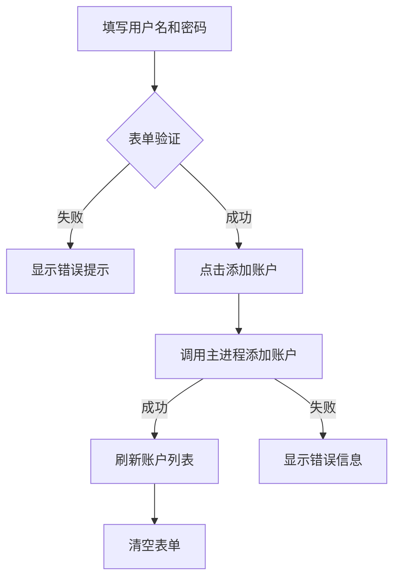
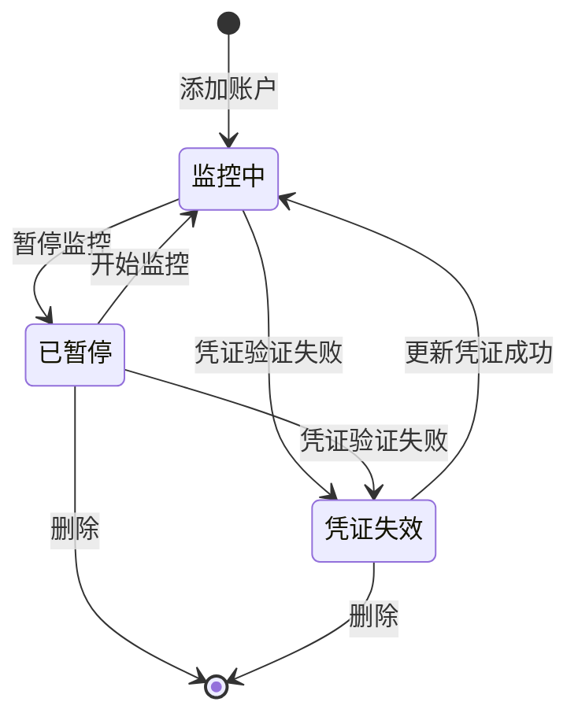

# 账户监控管理功能

## 功能概述

账户监控管理功能包含账户添加和监控列表两个核心组件，用于管理和监控多个账户的状态。

## 组件结构

### 1. AccountAdd 组件

**文件**: `src/renderer/src/components/AccountAdd.vue`

**功能**：

- 动态添加账户表单
- 支持多条目同时添加
- 表单验证（用户名和密码必填）

**特性**：

- ✅ 动态添加/删除表单项
- ✅ 必填项验证
- ✅ 卡片式布局
- ✅ 响应式设计

### 2. AccountList 组件

**文件**: `src/renderer/src/components/AccountList.vue`

**功能**：

- 以表格形式展示账户列表
- 显示账户状态
- 提供状态相关的操作按钮

**表格列**：

- **ID**: 账户唯一标识
- **用户名**: 账户用户名
- **监控状态**: 当前监控状态（带状态标签）
- **操作**: 根据状态显示不同操作按钮

## 监控状态定义

### 状态枚举

```typescript
enum MonitorStatus {
  MONITORING = 1, // 监控中
  PAUSED = 2, // 已暂停
  EXPIRED = 3 // 凭证失效
}
```

### 状态说明

| 状态值 | 状态名称 | 显示颜色 | 说明               |
| ------ | -------- | -------- | ------------------ |
| 1      | 监控中   | 绿色     | 账户正在正常监控中 |
| 2      | 已暂停   | 黄色     | 监控已被手动暂停   |
| 3      | 凭证失效 | 红色     | 账户凭证过期或无效 |

### 状态样式

```typescript
const statusStyles = {
  MONITORING: 'text-green-600 bg-green-50 dark:bg-green-950',
  PAUSED: 'text-amber-600 bg-amber-50 dark:bg-amber-950',
  EXPIRED: 'text-red-600 bg-red-50 dark:bg-red-950'
}
```

## 操作权限矩阵

### 操作定义

| 操作     | 图标      | 说明           |
| -------- | --------- | -------------- |
| 开始监控 | Play      | 开始或恢复监控 |
| 暂停监控 | Pause     | 暂停当前监控   |
| 更新凭证 | RefreshCw | 更新账户凭证   |
| 删除账户 | Trash2    | 删除账户记录   |

### 权限规则

```typescript
// 各操作的可用条件
const canStart = (status) => status === MonitorStatus.PAUSED
const canPause = (status) => status === MonitorStatus.MONITORING
const canUpdateCredentials = (status) => status === MonitorStatus.EXPIRED
const canDelete = (status) => status === MonitorStatus.EXPIRED || status === MonitorStatus.PAUSED
```

### 权限表格

| 状态     | 开始监控 | 暂停监控 | 更新凭证 | 删除 |
| -------- | -------- | -------- | -------- | ---- |
| 监控中   | ❌       | ✅       | ❌       | ❌   |
| 已暂停   | ✅       | ❌       | ❌       | ✅   |
| 凭证失效 | ❌       | ❌       | ✅       | ✅   |

## 操作流程

### 1. 添加账户流程



### 2. 状态转换流程



### 3. 操作执行流程

#### 开始监控

```typescript
1. 检查权限 (status === PAUSED)
2. 调用主进程启动监控
3. 更新状态为 MONITORING
4. 显示成功提示
```

#### 暂停监控

```typescript
1. 检查权限 (status === MONITORING)
2. 调用主进程暂停监控
3. 更新状态为 PAUSED
4. 显示成功提示
```

#### 更新凭证

```typescript
1. 检查权限 (status === EXPIRED)
2. 弹出对话框输入新凭证
3. 调用主进程更新凭证
4. 验证成功后更新状态为 MONITORING
5. 显示成功提示
```

#### 删除账户

```typescript
1. 检查权限 (status === EXPIRED || PAUSED)
2. 显示确认对话框
3. 用户确认后调用主进程删除
4. 从列表中移除账户
5. 显示成功提示
```

## UI 组件

### Table 组件

使用自定义的 Table 组件（基于 shadcn/ui 设计）：

**组件列表**：

- `Table`: 主容器
- `TableHeader`: 表头容器
- `TableBody`: 表体容器
- `TableRow`: 行组件
- `TableHead`: 表头单元格
- `TableCell`: 数据单元格

**文件位置**：

```
src/renderer/src/components/ui/table/
├── Table.vue
├── TableHeader.vue
├── TableBody.vue
├── TableRow.vue
├── TableHead.vue
├── TableCell.vue
└── index.ts
```

### 按钮样式

**主要按钮**（添加账户）：

```vue
<Button variant="default">添加账户</Button>
```

**次要按钮**（操作按钮）：

```vue
<Button variant="outline" size="sm">开始</Button>
```

**危险按钮**（删除）：

```vue
<Button variant="outline" size="sm" class="text-destructive">删除</Button>
```

## 数据接口

### Account 接口

```typescript
interface Account {
  id: number // 账户ID
  username: string // 用户名
  status: MonitorStatus // 监控状态
}
```

### 扩展字段（可选）

```typescript
interface AccountExtended extends Account {
  password?: string // 密码（仅用于添加，不存储在列表中）
  createdAt?: Date // 创建时间
  updatedAt?: Date // 更新时间
  lastSyncAt?: Date // 最后同步时间
  errorMessage?: string // 错误信息（凭证失效时）
}
```

## IPC 通信

### 待实现的 IPC 通道

**账户管理**：

```typescript
'account:add' // 添加账户
'account:delete' // 删除账户
'account:list' // 获取账户列表
'account:update' // 更新账户信息
```

**监控控制**：

```typescript
'monitor:start' // 开始监控
'monitor:pause' // 暂停监控
'monitor:status' // 获取监控状态
```

**凭证管理**：

```typescript
'credential:update' // 更新凭证
'credential:validate' // 验证凭证
```

## 错误处理

### 常见错误

| 错误类型     | 处理方式                         |
| ------------ | -------------------------------- |
| 凭证验证失败 | 更新状态为 EXPIRED，显示错误信息 |
| 网络连接失败 | 显示错误提示，保持当前状态       |
| 账户不存在   | 从列表中移除，显示提示           |
| 权限不足     | 禁用操作按钮，显示提示           |

### 错误提示

使用原生对话框显示错误信息：

```typescript
await window.api.dialog.showMessage({
  type: 'error',
  title: '操作失败',
  message: '暂停监控失败',
  detail: error.message
})
```

## 用户体验优化

### 1. 视觉反馈

- ✅ 状态标签使用颜色区分
- ✅ 操作按钮根据权限动态显示/隐藏
- ✅ 禁用的按钮显示为灰色
- ✅ 悬停效果增强交互感

### 2. 操作确认

**需要确认的操作**：

- 删除账户
- 批量操作

**不需要确认的操作**：

- 开始/暂停监控
- 刷新列表

### 3. 加载状态

```typescript
const isLoading = ref(false)

const handleOperation = async () => {
  isLoading.value = true
  try {
    // 执行操作
  } finally {
    isLoading.value = false
  }
}
```

### 4. 空状态

```vue
<TableRow v-if="accounts.length === 0">
  <TableCell colspan="4" class="text-center text-muted-foreground">
    暂无数据
  </TableCell>
</TableRow>
```

## 未来扩展

### 1. 批量操作

- [ ] 批量选择
- [ ] 批量开始/暂停
- [ ] 批量删除

### 2. 筛选和搜索

- [ ] 按状态筛选
- [ ] 按用户名搜索
- [ ] 高级筛选

### 3. 分页

- [ ] 分页组件
- [ ] 每页显示数量设置
- [ ] 跳转到指定页

### 4. 排序

- [ ] 按ID排序
- [ ] 按用户名排序
- [ ] 按状态排序

### 5. 详情查看

- [ ] 点击行查看详情
- [ ] 显示完整的账户信息
- [ ] 显示监控历史记录

## 相关文件

- **组件**:
  - [`AccountAdd.vue`](../src/renderer/src/components/AccountAdd.vue)
  - [`AccountList.vue`](../src/renderer/src/components/AccountList.vue)
- **页面**: [`Dashboard.vue`](../src/renderer/src/views/Dashboard.vue)
- **UI组件**: `src/renderer/src/components/ui/table/`

## 开发指南

### 本地测试

```bash
npm run dev
```

### 类型检查

```bash
npm run typecheck
```

### 构建

```bash
npm run build
```

---

**创建日期**: 2025-10-23
**最后更新**: 2025-10-23
