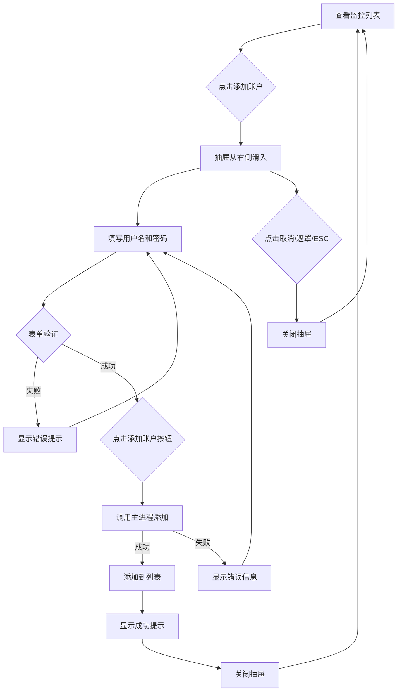

# 抽屉式账户添加功能

## 功能概述

将账户添加功能从独立组件改为抽屉（Drawer）形式，优化用户体验，使界面更加简洁。

## 更新内容

### 1. 新增 Drawer 组件 ✅

**文件**: `src/renderer/src/components/ui/drawer/Drawer.vue`

**特性**：

- ✅ 从右侧滑入的抽屉效果
- ✅ 遮罩层点击关闭
- ✅ ESC 键关闭
- ✅ 平滑过渡动画（300ms）
- ✅ 响应式宽度（移动端全屏，桌面端 500px）
- ✅ 支持标题、描述和底部按钮槽

**Props**：

```typescript
interface DrawerProps {
  open?: boolean // 是否打开
  title?: string // 标题
  description?: string // 描述
  side?: 'left' | 'right' // 滑入方向（默认 right）
}
```

**Slots**：

```typescript
{
  default: any        // 主要内容
  footer?: any        // 底部按钮区域
}
```

**使用示例**：

```vue
<Drawer v-model:open="isOpen" title="添加账户" description="添加需要监控的账户">
  <!-- 内容 -->
  <div>表单内容</div>

  <!-- 底部按钮 -->
  <template #footer>
    <Button @click="save">保存</Button>
  </template>
</Drawer>
```

### 2. 更新 AccountList 组件 ✅

**文件**: `src/renderer/src/components/AccountList.vue`

**变更**：

#### 新增导入

```typescript
import { Input } from '@/components/ui/input'
import { Drawer } from '@/components/ui/drawer'
import { Plus } from 'lucide-vue-next'
```

#### 新增状态

```typescript
// 抽屉状态
const isDrawerOpen = ref(false)

// 添加账户表单
const newAccount = ref({
  username: '',
  password: ''
})

// 表单错误
const formErrors = ref({
  username: '',
  password: ''
})
```

#### 新增方法

**打开抽屉**：

```typescript
const openAddDrawer = (): void => {
  // 清空表单
  newAccount.value = { username: '', password: '' }
  formErrors.value = { username: '', password: '' }
  isDrawerOpen.value = true
}
```

**表单验证**：

```typescript
const validateForm = (): boolean => {
  let isValid = true
  formErrors.value = { username: '', password: '' }

  if (!newAccount.value.username.trim()) {
    formErrors.value.username = '用户名为必填项'
    isValid = false
  }

  if (!newAccount.value.password.trim()) {
    formErrors.value.password = '密码为必填项'
    isValid = false
  }

  return isValid
}
```

**添加账户**：

```typescript
const handleAddAccount = async (): Promise<void> => {
  if (!validateForm()) return

  try {
    // TODO: 调用主进程添加账户

    // 模拟添加成功
    const newId = Math.max(...accounts.value.map((a) => a.id), 0) + 1
    accounts.value.push({
      id: newId,
      username: newAccount.value.username,
      status: MonitorStatus.MONITORING
    })

    alert(`账户 ${newAccount.value.username} 添加成功！`)
    isDrawerOpen.value = false
  } catch (error) {
    console.error('添加账户失败:', error)
    alert('添加账户失败，请重试')
  }
}
```

#### UI 变更

**按钮组**（在 CardHeader 中）：

```vue
<div class="flex gap-2">
  <!-- 新增：添加账户按钮 -->
  <Button variant="outline" size="sm" @click="openAddDrawer">
    <Plus class="w-4 h-4" />
    添加账户
  </Button>

  <!-- 原有：刷新按钮 -->
  <Button variant="outline" size="sm" @click="refreshList">
    <RefreshCw class="w-4 h-4" />
    刷新
  </Button>
</div>
```

**抽屉内容**：

```vue
<Drawer v-model:open="isDrawerOpen" title="添加账户" description="添加需要监控的账户">
  <!-- 用户名输入 -->
  <div class="space-y-2">
    <label>用户名 <span class="text-red-500">*</span></label>
    <Input
      v-model="newAccount.username"
      placeholder="请输入用户名"
      :class="formErrors.username ? 'border-red-500' : ''"
    />
    <p v-if="formErrors.username" class="text-xs text-red-500">
      {{ formErrors.username }}
    </p>
  </div>

  <!-- 密码输入 -->
  <div class="space-y-2">
    <label>密码 <span class="text-red-500">*</span></label>
    <Input
      v-model="newAccount.password"
      type="password"
      placeholder="请输入密码"
      :class="formErrors.password ? 'border-red-500' : ''"
    />
    <p v-if="formErrors.password" class="text-xs text-red-500">
      {{ formErrors.password }}
    </p>
  </div>

  <!-- 底部按钮 -->
  <template #footer>
    <div class="flex justify-end gap-3">
      <Button variant="outline" @click="isDrawerOpen = false">取消</Button>
      <Button
        :disabled="!newAccount.username || !newAccount.password"
        @click="handleAddAccount"
      >
        添加账户
      </Button>
    </div>
  </template>
</Drawer>
```

### 3. 更新 Dashboard 组件 ✅

**文件**: `src/renderer/src/views/Dashboard.vue`

**变更**：

- ❌ 移除 `AccountAdd` 组件导入和使用
- ✅ 简化为只使用 `AccountList` 组件

```vue
<script setup lang="ts">
import AccountList from '@/components/AccountList.vue'
</script>

<template>
  <div class="max-w-7xl mx-auto">
    <div class="mb-6">
      <h2 class="text-3xl font-bold">监控管理</h2>
      <p class="text-muted-foreground mt-2">管理和监控所有账户</p>
    </div>

    <!-- 监控列表（包含添加功能） -->
    <AccountList />
  </div>
</template>
```

### 4. AccountAdd 组件状态 ⚠️

**文件**: `src/renderer/src/components/AccountAdd.vue`

**状态**: 保留但不再使用

- 可以保留作为备用或其他场景使用
- 或者可以删除以简化代码库

## 界面效果

### 布局变化

**之前**：

```
[页面标题]
┌─────────────────────────┐
│  账户添加卡片（独立）    │
│  - 表单1                 │
│  - 表单2                 │
│  - 添加按钮              │
└─────────────────────────┘

┌─────────────────────────┐
│  账户列表（Table）       │
│  - 账户1                 │
│  - 账户2                 │
└─────────────────────────┘
```

**现在**：

```
[页面标题]
┌─────────────────────────────────────┐
│  账户监控列表                        │
│  [+ 添加账户] [🔄 刷新]             │
│  ─────────────────────────────────  │
│  ID | 用户名 | 状态 | 操作          │
│  ─────────────────────────────────  │
│  1  | user1  | 监控中 | [暂停]      │
│  2  | user2  | 已暂停 | [开始][删除]│
└─────────────────────────────────────┘

点击"添加账户"后 →
                          ┌──────────────┐
                          │ 添加账户      X│
                          │──────────────│
                          │ 用户名 *      │
                          │ [输入框]      │
                          │              │
                          │ 密码 *        │
                          │ [输入框]      │
                          │              │
                          │──────────────│
                          │ [取消][添加] │
                          └──────────────┘
```

## 用户交互流程



## 优势对比

### 使用抽屉的优点

| 特性           | 独立组件        | 抽屉组件        |
| -------------- | --------------- | --------------- |
| **空间利用**   | ❌ 占用页面空间 | ✅ 覆盖在页面上 |
| **视觉焦点**   | ❌ 分散注意力   | ✅ 聚焦于表单   |
| **交互流畅**   | ⚠️ 需要滚动     | ✅ 滑入动画     |
| **移动端适配** | ❌ 布局复杂     | ✅ 全屏抽屉     |
| **取消操作**   | ⚠️ 不直观       | ✅ 点击遮罩/ESC |

### 改进点

1. **✅ 节省空间**: 不占用主页面空间
2. **✅ 更好的焦点**: 抽屉 + 遮罩引导用户注意
3. **✅ 流畅动画**: 平滑的滑入/滑出效果
4. **✅ 移动端友好**: 全屏抽屉适合小屏幕
5. **✅ 操作明确**: 取消/关闭方式多样（按钮、遮罩、ESC）

## 技术细节

### Drawer 组件实现

**双向绑定**：

```typescript
const isOpen = computed({
  get: () => props.open,
  set: (value) => emit('update:open', value)
})
```

**过渡动画**：

```vue
<Transition
  enter-active-class="transition-transform duration-300"
  enter-from-class="translate-x-full"
  enter-to-class="translate-x-0"
  leave-active-class="transition-transform duration-300"
  leave-from-class="translate-x-0"
  leave-to-class="translate-x-full"
>
  <!-- 抽屉内容 -->
</Transition>
```

**ESC 键监听**：

```typescript
watch(
  () => props.open,
  (newVal) => {
    if (newVal) {
      const handleEsc = (e: KeyboardEvent): void => {
        if (e.key === 'Escape') close()
      }
      document.addEventListener('keydown', handleEsc)
      return (): void => {
        document.removeEventListener('keydown', handleEsc)
      }
    }
    return undefined
  }
)
```

### 表单验证

**实时错误清除**：

```vue
<Input v-model="newAccount.username" @input="formErrors.username = ''" />
```

**提交时验证**：

```typescript
const handleAddAccount = async (): Promise<void> => {
  if (!validateForm()) return
  // 继续处理...
}
```

## 待实现功能

### 后端集成

需要在主进程实现以下 IPC 通道：

```typescript
// src/shared/ipc/channels.ts
'account:add': {
  request: { username: string; password: string }
  response: { success: boolean; id?: number; error?: string }
}
```

### 增强功能

- [ ] 添加加载状态（提交时显示加载动画）
- [ ] 成功后自动刷新列表
- [ ] 支持批量添加
- [ ] 导入账户（CSV/JSON）
- [ ] 添加更多表单字段（备注、分组等）

## 相关文件

- **Drawer 组件**:
  - [`Drawer.vue`](../src/renderer/src/components/ui/drawer/Drawer.vue)
  - [`index.ts`](../src/renderer/src/components/ui/drawer/index.ts)
- **账户列表**: [`AccountList.vue`](../src/renderer/src/components/AccountList.vue)
- **页面**: [`Dashboard.vue`](../src/renderer/src/views/Dashboard.vue)
- **（废弃）账户添加**: [`AccountAdd.vue`](../src/renderer/src/components/AccountAdd.vue)

## 验证结果

```bash
npm run typecheck  # ✅ 通过
```

---

**创建日期**: 2025-10-23
**最后更新**: 2025-10-23
