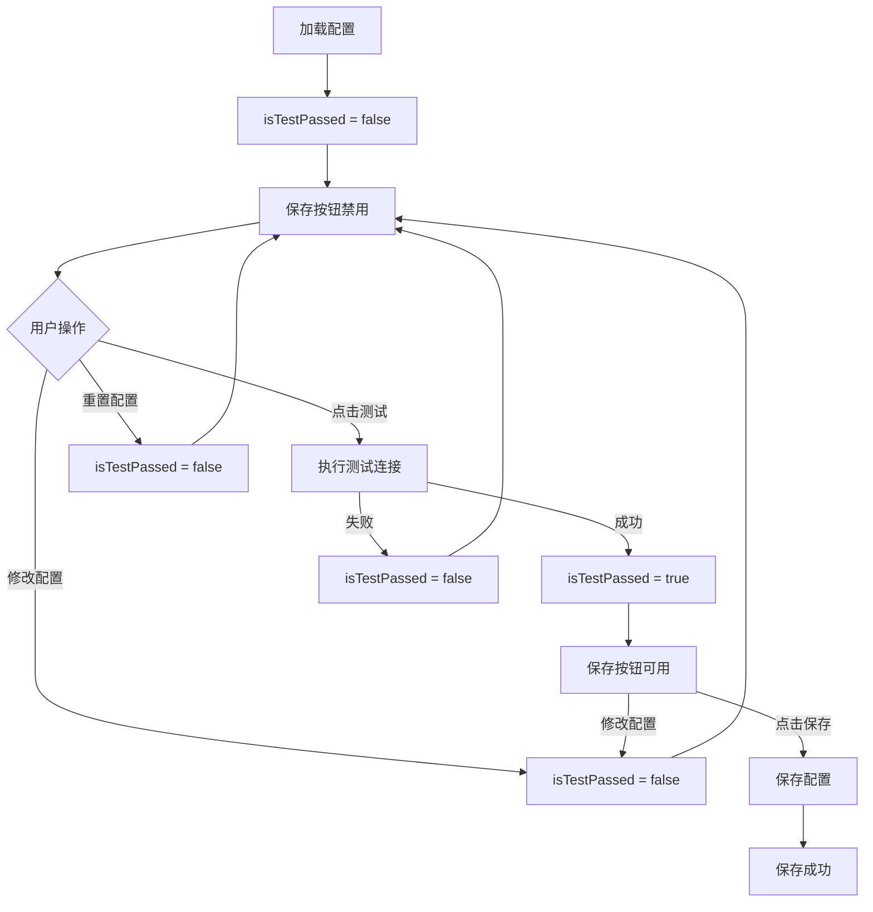

# 测试后才能保存功能说明

## 功能概述

实现了"必须先测试连接成功后才能保存配置"的安全机制，确保所有保存的配置都是经过验证的有效配置。

## 业务逻辑

### 核心规则

1. **初始状态**：加载配置后，保存按钮不可用（需要测试）
2. **配置修改**：任何配置修改后，保存按钮立即变为不可用
3. **测试成功**：测试连接成功后，保存按钮变为可用
4. **测试失败**：测试连接失败，保存按钮保持不可用
5. **重置配置**：重置后需要重新测试

### 状态流转图



## 实现细节

### 1. 状态管理

**新增状态变量**：

```typescript
const isTestPassed = ref(false) // 测试是否通过
```

### 2. 监听配置变化

使用 Vue 3 的 `watch` API 深度监听配置对象：

```typescript
watch(
  config,
  () => {
    isTestPassed.value = false // 任何修改都重置测试状态
  },
  { deep: true } // 深度监听
)
```

**监听范围**：

- API 配置：`apiUrl`, `testApiUrl`
- SSH 配置：`server`, `port`, `user`, `password`, `useSshKey`, `privateKey`

### 3. 测试成功处理

```typescript
const testConnection = async (): Promise<void> => {
  // ... 测试逻辑

  if (result.success) {
    isTestPassed.value = true // 设置为通过
    // 显示成功提示
  } else {
    isTestPassed.value = false // 保持为未通过
    // 显示错误提示
  }
}
```

### 4. 保存前检查

```typescript
const saveConfig = async (): Promise<void> => {
  // 第一步：检查测试状态
  if (!isTestPassed.value) {
    await window.api.dialog.showMessage({
      type: 'warning',
      title: '无法保存',
      message: '请先测试连接成功后再保存配置'
    })
    return // 阻止保存
  }

  // 继续保存逻辑...
}
```

### 5. UI 状态

**保存按钮**：

```vue
<Button
  :disabled="isSaving || !isTestPassed"
  class="gap-2"
  @click="saveConfig"
  :class="!isTestPassed ? 'opacity-50 cursor-not-allowed' : ''"
>
  <Save class="w-4 h-4" />
  {{ isSaving ? '保存中...' : '保存配置' }}
</Button>
```

**状态提示**：

```vue
<!-- 未通过测试 -->
<p v-if="!isTestPassed" class="text-xs text-amber-600">
  ⚠️ 请先测试连接成功后再保存配置
</p>

<!-- 已通过测试 -->
<p v-else class="text-xs text-green-600">
  ✅ 测试通过，可以保存配置
</p>
```

## 用户体验流程

### 场景 1: 新建配置

1. 打开系统设置页面
2. 看到提示："⚠️ 请先测试连接成功后再保存配置"
3. 保存按钮显示为禁用状态（灰色、半透明）
4. 填写配置信息
5. 点击"测试连接"按钮
6. 测试成功后，提示变为："✅ 测试通过，可以保存配置"
7. 保存按钮变为可用状态（正常颜色）
8. 点击"保存配置"完成

### 场景 2: 修改配置

1. 打开已有配置
2. 保存按钮初始为禁用（因为未测试）
3. 修改任何配置项（如修改 API 地址）
4. 保存按钮保持禁用
5. 点击"测试连接"
6. 测试成功后，保存按钮变为可用
7. 可以保存修改

### 场景 3: 测试失败

1. 填写配置
2. 点击"测试连接"
3. 测试失败，显示错误信息
4. 保存按钮仍然禁用
5. 修正配置
6. 重新测试，直到成功
7. 保存按钮变为可用

### 场景 4: 重置配置

1. 点击"重置配置"
2. 确认重置
3. 配置恢复默认值
4. `isTestPassed` 自动设置为 `false`
5. 保存按钮变为禁用
6. 需要重新测试后才能保存

## 优势

### 1. 数据安全

- ✅ 防止保存无效配置
- ✅ 确保配置可用性
- ✅ 避免错误配置导致的系统故障

### 2. 用户体验

- ✅ 清晰的状态提示
- ✅ 按钮禁用视觉反馈
- ✅ 操作流程引导
- ✅ 友好的错误提示

### 3. 开发友好

- ✅ 简洁的状态管理
- ✅ 响应式的 UI 更新
- ✅ 易于维护和扩展

## 技术要点

### Vue 3 Composition API

**响应式状态**：

```typescript
const isTestPassed = ref(false)
```

**深度监听**：

```typescript
watch(config, () => { ... }, { deep: true })
```

**条件渲染**：

```vue
<p v-if="!isTestPassed">...</p>
<p v-else>...</p>
```

**动态属性绑定**：

```vue
:disabled="!isTestPassed" :class="!isTestPassed ? 'opacity-50' : ''"
```

### 状态重置时机

| 操作     | isTestPassed 变化 | 原因                            |
| -------- | ----------------- | ------------------------------- |
| 加载配置 | → false           | 需要验证配置有效性              |
| 修改配置 | → false           | 配置已变更，需要重新测试        |
| 测试成功 | → true            | 验证通过                        |
| 测试失败 | → false           | 验证未通过                      |
| 重置配置 | → false           | 配置已改变                      |
| 保存成功 | 保持不变          | 可选：重置为 false 强制再次测试 |

## 配置项说明

### API 配置

- `apiUrl`: 接口地址（必填）
- `testApiUrl`: 测试接口地址（测试时必填）

### SSH 配置（条件必填）

- `server`: SSH 服务器地址
- `port`: SSH 端口（默认 22）
- `user`: 用户名
- `password` 或 `privateKey`: 二选一

## 错误处理

### 1. 未测试就保存

```typescript
if (!isTestPassed.value) {
  // 显示警告对话框
  await window.api.dialog.showMessage({
    type: 'warning',
    title: '无法保存',
    message: '请先测试连接成功后再保存配置'
  })
  return
}
```

### 2. 测试失败

```typescript
if (!result.success) {
  isTestPassed.value = false
  // 显示详细错误信息
  await window.api.dialog.showMessage({
    type: 'error',
    title: '连接失败',
    message: result.error,
    detail: result.details
  })
}
```

## 扩展性

### 可选：保存后自动重置测试状态

如果希望每次保存后都必须重新测试：

```typescript
const saveConfig = async (): Promise<void> => {
  // ... 保存逻辑

  await ConfigStore.save(config.value)

  // 保存成功后重置测试状态
  isTestPassed.value = false

  await window.api.dialog.showMessage({
    type: 'success',
    title: '成功',
    message: '配置保存成功！下次修改前请重新测试。'
  })
}
```

### 可选：添加测试时间戳

记录最后一次测试时间，超时后自动失效：

```typescript
const lastTestedAt = ref<number>(0)
const TEST_VALIDITY_DURATION = 5 * 60 * 1000 // 5分钟

const isTestValid = computed(() => {
  return isTestPassed.value && Date.now() - lastTestedAt.value < TEST_VALIDITY_DURATION
})
```

## 相关文件

- **组件**: [`src/renderer/src/views/Configuration.vue`](../src/renderer/src/views/Configuration.vue)
- **状态管理**: [`src/renderer/src/stores/config.ts`](../src/renderer/src/stores/config.ts)
- **测试服务**: [`src/main/services/connectionTestService.ts`](../src/main/services/connectionTestService.ts)

## 参考文档

- [表单验证](./FORM_VALIDATION.md)
- [测试连接功能](./TEST_CONNECTION.md)
- [SSH 隧道 HTTP 请求修复](./FIX_SSH_HTTP_REQUEST.md)

---

**创建日期**: 2025-10-23
**最后更新**: 2025-10-23
