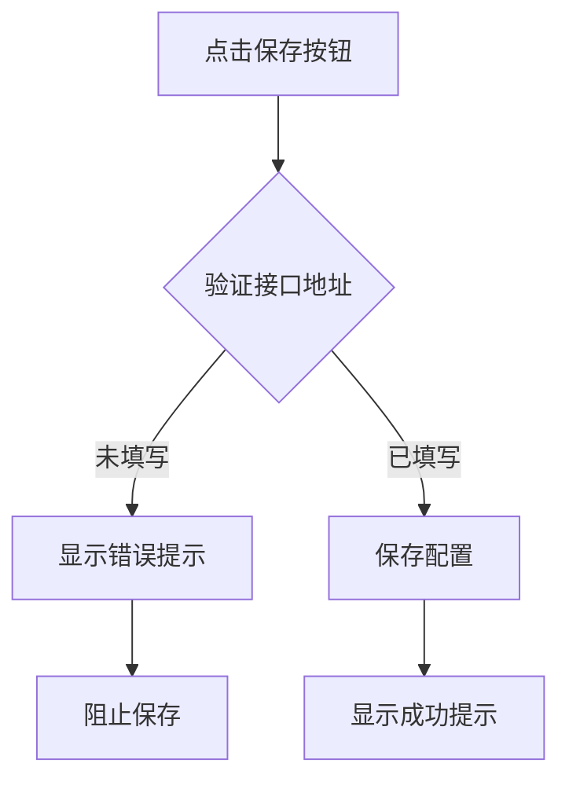
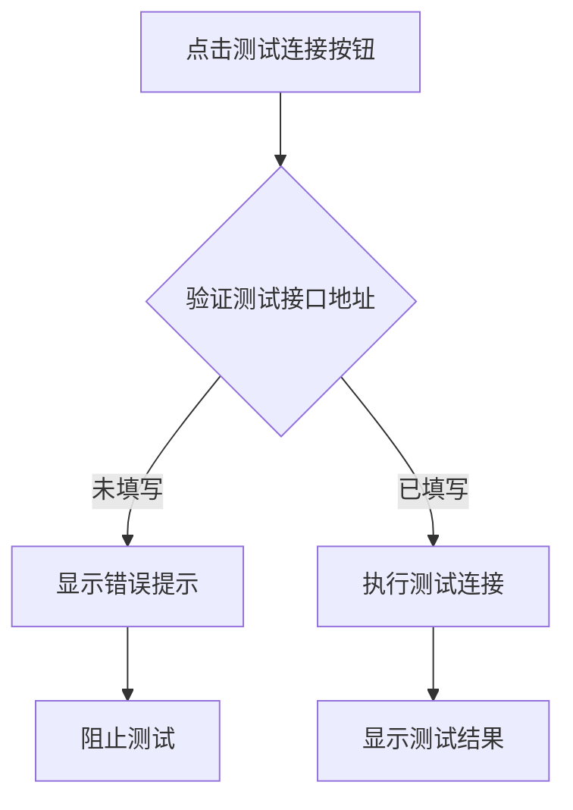

# 表单验证规则文档

## 系统设置表单验证

本文档说明系统设置页面的表单验证规则。

## 验证规则

### 1. 接口配置

#### 1.1 接口地址 (apiUrl)

- **必填**: ✅ 是
- **验证时机**: 保存配置时
- **错误提示**: "接口地址为必填项"
- **标识**: 字段标签带红色星号 (\*)
- **视觉反馈**:
  - 错误时输入框边框变红
  - 输入时自动清除错误提示

**代码示例**:

```vue
<label>
  接口地址
  <span class="text-red-500 ml-1">*</span>
</label>
<Input
  v-model="config.api.apiUrl"
  :class="errors.apiUrl ? 'border-red-500' : ''"
  @input="clearError('apiUrl')"
/>
<p v-if="errors.apiUrl" class="text-xs text-red-500">
  {{ errors.apiUrl }}
</p>
```

#### 1.2 测试接口地址 (testApi)

- **必填**: ⚠️ 条件必填（点击"测试连接"按钮时）
- **验证时机**: 点击"测试连接"按钮时
- **错误提示**: "测试接口地址为必填项"
- **标识**: 字段标签无星号（非总是必填）
- **视觉反馈**:
  - 错误时输入框边框变红
  - 输入时自动清除错误提示

**特殊说明**:

- 保存配置时**不验证**此字段
- 只在点击"测试连接"时验证
- 允许保存时留空

### 2. SSH 配置

#### 2.1 条件验证规则

SSH 配置采用**条件必填**验证策略：

- **未填写 Server 地址时**: 所有 SSH 字段均为非必填
- **填写了 Server 地址后**: 以下字段变为必填

#### 2.2 必填字段（当 Server 不为空时）

**Port（端口）**

- **必填**: ⚠️ 条件必填
- **条件**: Server 地址不为空
- **规则**: 必须大于 0
- **错误提示**: "Port 为必填项"
- **标识**: Server 不为空时显示红色星号

**User（用户名）**

- **必填**: ⚠️ 条件必填
- **条件**: Server 地址不为空
- **规则**: 不能为空字符串
- **错误提示**: "User 为必填项"
- **标识**: Server 不为空时显示红色星号

#### 2.3 认证方式（二选一必填）

当 Server 地址不为空时，以下两种认证方式至少选择一种：

**Password（密码认证）**

- **规则**: 如果未使用 SSH Key，则必须填写密码
- **禁用条件**: 勾选 "Use SSH key" 时禁用
- **标识**: Server 不为空且未勾选 SSH Key 时显示红色星号

**SSH Key（密钥认证）**

- **规则**: 如果勾选了 "Use SSH key"，则必须填写私钥内容或路径
- **显示条件**: 仅当 `config.ssh.useSshKey` 为 `true` 时显示
- **标识**: Server 不为空时显示红色星号

**组合验证**

- 如果两者都未填写，显示错误："Password 或 SSH Key 至少填写一个"
- 错误字段：`errors.sshAuth`

#### 2.4 验证实现

```typescript
const validateSshConfig = (): boolean => {
  const server = config.value.ssh.server.trim()

  // 如果没有填写 server，则不验证 SSH 配置
  if (!server) {
    return true
  }

  let isValid = true

  // 验证 Port
  if (!config.value.ssh.port || config.value.ssh.port <= 0) {
    errors.value.sshPort = 'Port 为必填项'
    isValid = false
  }

  // 验证 User
  if (!config.value.ssh.user.trim()) {
    errors.value.sshUser = 'User 为必填项'
    isValid = false
  }

  // 验证认证方式
  const hasPassword = config.value.ssh.password.trim().length > 0
  const hasSshKey =
    config.value.ssh.useSshKey && (config.value.ssh.privateKey?.trim() || '').length > 0

  if (!hasPassword && !hasSshKey) {
    errors.value.sshAuth = 'Password 或 SSH Key 至少填写一个'
    isValid = false
  }

  return isValid
}
```

## 验证流程

### 保存配置流程



**实现代码**:

```typescript
const saveConfig = async (): Promise<void> => {
  // 验证接口地址（必填）
  if (!validateApiUrl()) {
    saveMessage.value = '请填写必填项'
    return
  }

  // 验证 SSH 配置（如果填写了 server）
  if (!validateSshConfig()) {
    saveMessage.value = '请完善 SSH 配置信息'
    return
  }

  // 保存配置
  await ConfigStore.save(config.value)
  saveMessage.value = '配置保存成功！'
}
```

### 测试连接流程



**实现代码**:

```typescript
const testConnection = (): void => {
  // 验证测试接口地址（点击测试时必填）
  if (!validatetestApi()) {
    saveMessage.value = '请填写测试接口地址'
    return
  }

  // 执行测试连接逻辑
  console.log('测试SSH连接:', config.value.ssh)
}
```

## 用户体验优化

### 1. 实时错误清除

当用户开始输入时，自动清除错误提示：

```vue
<Input v-model="config.api.apiUrl" @input="clearError('apiUrl')" />
```

**好处**:

- ✅ 减少用户困扰
- ✅ 即时反馈
- ✅ 鼓励用户修正错误

### 2. 视觉提示层次

| 提示类型 | 视觉效果      | 使用场景     |
| -------- | ------------- | ------------ |
| 必填标识 | 红色星号 (\*) | 接口地址     |
| 错误边框 | 红色边框      | 验证失败     |
| 错误文字 | 红色小字      | 错误原因说明 |
| 成功提示 | 绿色背景框    | 保存成功     |
| 失败提示 | 红色背景框    | 操作失败     |

### 3. 错误提示位置

```vue
<div class="space-y-2">
  <label>字段名</label>
  <Input />
  <!-- 错误提示紧跟在输入框下方 -->
  <p v-if="errors.field" class="text-xs text-red-500 mt-1">
    {{ errors.field }}
  </p>
</div>
```

## 验证函数实现

### validateApiUrl

验证接口地址是否填写：

```typescript
const validateApiUrl = (): boolean => {
  if (!config.value.api.apiUrl.trim()) {
    errors.value.apiUrl = '接口地址为必填项'
    return false
  }
  errors.value.apiUrl = ''
  return true
}
```

### validatetestApi

验证测试接口地址是否填写：

```typescript
const validatetestApi = (): boolean => {
  if (!config.value.api.testApi.trim()) {
    errors.value.testApi = '测试接口地址为必填项'
    return false
  }
  errors.value.testApi = ''
  return true
}
```

### clearError

清除指定字段的错误：

```typescript
const clearError = (
  field: 'apiUrl' | 'testApi' | 'sshServer' | 'sshPort' | 'sshUser' | 'sshAuth'
): void => {
  errors.value[field] = ''
}
```

## 扩展验证

### 未来可能添加的验证

1. **URL 格式验证**

```typescript
const isValidUrl = (url: string): boolean => {
  try {
    new URL(url)
    return true
  } catch {
    return false
  }
}

const validateApiUrl = (): boolean => {
  if (!config.value.api.apiUrl.trim()) {
    errors.value.apiUrl = '接口地址为必填项'
    return false
  }
  if (!isValidUrl(config.value.api.apiUrl)) {
    errors.value.apiUrl = '请输入有效的 URL 地址'
    return false
  }
  errors.value.apiUrl = ''
  return true
}
```

2. **端口号范围验证**

```typescript
const validatePort = (): boolean => {
  const port = config.value.ssh.port
  if (port < 1 || port > 65535) {
    errors.value.sshPort = '端口号范围：1-65535'
    return false
  }
  return true
}
```

3. **IP 地址格式验证**

```typescript
const isValidIP = (ip: string): boolean => {
  const ipRegex = /^(\d{1,3}\.){3}\d{1,3}$/
  if (!ipRegex.test(ip)) return false

  return ip.split('.').every((num) => {
    const n = parseInt(num)
    return n >= 0 && n <= 255
  })
}
```

## 测试场景

### 场景 1: 保存空配置

**操作步骤**:

1. 打开系统设置页面
2. 不填写任何内容
3. 点击"保存配置"按钮

**预期结果**:

- ❌ 接口地址显示错误："接口地址为必填项"
- ❌ 输入框边框变红
- ❌ 配置未保存
- ✅ 显示提示："请填写必填项"

### 场景 2: 只填写接口地址

**操作步骤**:

1. 打开系统设置页面
2. 只填写"接口地址"
3. 点击"保存配置"按钮

**预期结果**:

- ✅ 验证通过
- ✅ 配置保存成功
- ✅ 显示提示："配置保存成功！"

### 场景 3: 测试连接（未填测试地址）

**操作步骤**:

1. 打开系统设置页面
2. 不填写"测试接口地址"
3. 点击"测试连接"按钮

**预期结果**:

- ❌ 测试接口地址显示错误："测试接口地址为必填项"
- ❌ 输入框边框变红
- ❌ 测试未执行
- ✅ 显示提示："请填写测试接口地址"

### 场景 4: 实时错误清除

**操作步骤**:

1. 打开系统设置页面
2. 点击"保存配置"触发验证错误
3. 在"接口地址"输入框中输入内容

**预期结果**:

- ✅ 错误提示自动消失
- ✅ 红色边框自动消失
- ✅ 用户体验流畅

### 场景 5: SSH 配置可选

**操作步骤**:

1. 打开系统设置页面
2. 只填写"接口地址"
3. 不填写任何 SSH 配置
4. 点击"保存配置"按钮

**预期结果**:

- ✅ 验证通过
- ✅ 配置保存成功
- ✅ SSH 配置保存为空值
- ✅ 不显示任何 SSH 相关错误

## 错误消息列表

| 字段         | 错误消息                           | 触发条件                    |
| ------------ | ---------------------------------- | --------------------------- |
| 接口地址     | "接口地址为必填项"                 | 保存时字段为空              |
| 测试接口地址 | "测试接口地址为必填项"             | 测试时字段为空              |
| SSH Port     | "Port 为必填项"                    | Server 不为空且 Port ≤ 0    |
| SSH User     | "User 为必填项"                    | Server 不为空且 User 为空   |
| SSH 认证     | "Password 或 SSH Key 至少填写一个" | Server 不为空且两者都未填写 |
| 通用保存错误 | "请填写必填项"                     | 保存时验证失败              |
| SSH 配置错误 | "请完善 SSH 配置信息"              | 保存时 SSH 验证失败         |
| 通用测试错误 | "请填写测试接口地址"               | 测试时验证失败              |
| 保存成功     | "配置保存成功！"                   | 保存成功                    |
| 保存失败     | "配置保存失败，请重试"             | 保存异常                    |

## 最佳实践

1. ✅ **明确标识必填项**: 使用红色星号 (\*)
2. ✅ **即时反馈**: 输入时清除错误
3. ✅ **友好提示**: 错误消息清晰明确
4. ✅ **视觉层次**: 使用颜色区分状态
5. ✅ **条件验证**: 根据操作类型选择验证规则
6. ✅ **用户体验**: 不过度验证可选字段

## 相关文件

- 表单组件: [`src/renderer/src/views/Configuration.vue`](../src/renderer/src/views/Configuration.vue)
- 配置存储: [`src/renderer/src/stores/config.ts`](../src/renderer/src/stores/config.ts)
- 配置管理器: [`src/main/config/configManager.ts`](../src/main/config/configManager.ts)

---

**创建日期**: 2025-10-23
**维护者**: 开发团队
**状态**: ✅ 已实现
