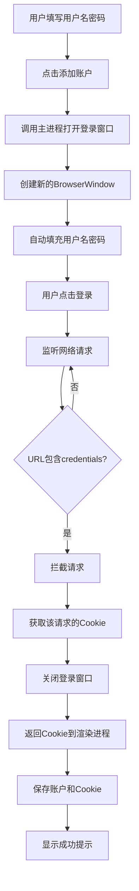

# 登录窗口与 Cookie 获取功能

## 功能概述

实现了通过打开独立登录窗口，监听网络请求中包含 `credentials` 的接口，并自动获取该接口返回的 Cookie 的完整功能。

## 业务流程



## 核心实现

### 1. IPC 通道定义

**文件**: `src/shared/ipc/channels.ts`

```typescript
export const ACCOUNT_CHANNELS = {
  OPEN_LOGIN_WINDOW: 'account:openLoginWindow'
} as const
```

### 2. 类型定义

**文件**: `src/shared/ipc/types.ts`

```typescript
/**
 * 账户信息
 */
export interface Account {
  id: number
  username: string
  status: number
  cookie?: string
  createdAt?: Date
}

/**
 * 打开登录窗口请求
 */
export interface OpenLoginWindowRequest {
  username: string
  password: string
  loginUrl: string // 登录页面URL
}

/**
 * 打开登录窗口响应
 */
export interface OpenLoginWindowResponse {
  success: boolean
  cookie?: string // 获取到的Cookie
  error?: string
}
```

### 3. 登录窗口服务

**文件**: `src/main/services/loginWindowService.ts`

#### 核心功能

**创建登录窗口**：

```typescript
this.loginWindow = new BrowserWindow({
  width: 1200,
  height: 800,
  title: '账户登录',
  webPreferences: {
    nodeIntegration: false,
    contextIsolation: true,
    webSecurity: true
  }
})
```

**监听网络请求**：

```typescript
const filter = {
  urls: ['*://*/*credentials*'] // 匹配包含 credentials 的 URL
}

// 拦截响应
windowSession.webRequest.onCompleted(filter, async (details) => {
  console.log('拦截到包含 credentials 的请求:', details.url)

  // 获取该请求的 Cookie
  const cookies = await windowSession.cookies.get({ url: details.url })

  if (cookies.length > 0) {
    // 转换为字符串格式
    const cookieString = cookies.map((cookie) => `${cookie.name}=${cookie.value}`).join('; ')

    // 关闭窗口并返回结果
    resolve({ success: true, cookie: cookieString })
  }
})
```

**自动填充表单**：

```typescript
this.loginWindow.webContents.on('did-finish-load', () => {
  this.loginWindow.webContents.executeJavaScript(`
    const usernameInput = document.querySelector('input[name="username"]');
    const passwordInput = document.querySelector('input[type="password"]');

    if (usernameInput) {
      usernameInput.value = '${options.username}';
      usernameInput.dispatchEvent(new Event('input', { bubbles: true }));
    }

    if (passwordInput) {
      passwordInput.value = '${options.password}';
      passwordInput.dispatchEvent(new Event('input', { bubbles: true }));
    }
  `)
})
```

### 4. IPC 处理器

**文件**: `src/main/ipc/handlers.ts`

```typescript
function registerAccountHandlers(): void {
  ipcMain.handle(
    IPC_CHANNELS.OPEN_LOGIN_WINDOW,
    async (_, request: OpenLoginWindowRequest): Promise<OpenLoginWindowResponse> => {
      try {
        const result = await loginWindowService.openLoginWindow(request)
        return result
      } catch (error) {
        return {
          success: false,
          error: error instanceof Error ? error.message : '打开登录窗口失败'
        }
      }
    }
  )
}
```

### 5. Preload 暴露 API

**文件**: `src/preload/index.ts`

```typescript
const api = {
  account: {
    openLoginWindow: (request: IPCTypeMap['account:openLoginWindow']['request']) =>
      ipcRenderer.invoke(IPC_CHANNELS.OPEN_LOGIN_WINDOW, request) as Promise<
        IPCTypeMap['account:openLoginWindow']['response']
      >
  }
}
```

### 6. 渲染进程调用

**文件**: `src/renderer/src/components/AccountList.vue`

```typescript
const handleAddAccount = async (): Promise<void> => {
  // 表单验证
  if (!validateForm()) return

  try {
    // 打开登录窗口获取 Cookie
    const result = await window.api.account.openLoginWindow({
      username: newAccount.value.username,
      password: newAccount.value.password,
      loginUrl: 'https://your-login-url.com/login'
    })

    if (result.success && result.cookie) {
      console.log('获取到 Cookie:', result.cookie)

      // 保存账户和 Cookie
      // TODO: 调用主进程保存账户

      await window.api.dialog.showMessage({
        type: 'success',
        title: '成功',
        message: `账户 ${newAccount.value.username} 添加成功！`,
        detail: `Cookie: ${result.cookie.substring(0, 50)}...`
      })

      isDrawerOpen.value = false
    } else {
      await window.api.dialog.showMessage({
        type: 'error',
        title: '错误',
        message: '获取 Cookie 失败',
        detail: result.error || '未知错误'
      })
    }
  } catch (error) {
    console.error('添加账户失败:', error)
  }
}
```

## 技术细节

### 网络请求拦截

使用 Electron 的 `webRequest` API 拦截网络请求：

```typescript
session.webRequest.onCompleted(filter, callback)
```

**参数说明**：

- `filter`: URL 匹配规则
  - `'*://*/*credentials*'` - 匹配任何协议、域名下包含 credentials 的路径
  - 可以更精确匹配：`'https://api.example.com/*/credentials'`
- `callback`: 请求完成时的回调函数

### Cookie 获取

```typescript
const cookies = await session.cookies.get({
  url: 'https://example.com'
})

// Cookie 对象结构
interface Cookie {
  name: string // Cookie 名称
  value: string // Cookie 值
  domain: string // 域名
  path: string // 路径
  secure: boolean // 是否仅HTTPS
  httpOnly: boolean // 是否仅HTTP
  expirationDate?: number // 过期时间
}
```

### Cookie 格式转换

```typescript
const cookieString = cookies.map((cookie) => `${cookie.name}=${cookie.value}`).join('; ')

// 结果示例：
// "session_id=abc123; token=xyz789; user=john"
```

### 自动填充表单

**选择器策略**（按优先级）：

```typescript
// 1. 通过 name 属性
document.querySelector('input[name="username"]')

// 2. 通过 type 属性
document.querySelector('input[type="text"]')

// 3. 通过 placeholder
document.querySelector('input[placeholder*="用户名"]')

// 4. 通过 ID
document.querySelector('#username')
```

**触发输入事件**：

```typescript
input.dispatchEvent(new Event('input', { bubbles: true }))
input.dispatchEvent(new Event('change', { bubbles: true }))
```

## 配置说明

### 登录 URL

需要根据实际情况修改登录 URL：

```typescript
// AccountList.vue 中
const result = await window.api.account.openLoginWindow({
  username: newAccount.value.username,
  password: newAccount.value.password,
  loginUrl: 'https://your-actual-login-url.com/login' // 修改为实际URL
})
```

### URL 匹配规则

根据实际的 credentials 接口 URL 调整匹配规则：

```typescript
// loginWindowService.ts 中
const filter = {
  // 示例1：精确匹配
  urls: ['https://api.example.com/auth/credentials']

  // 示例2：模糊匹配
  urls: ['*://*/*credentials*']

  // 示例3：多个模式
  urls: [
    '*://*/*credentials*',
    '*://*/*auth/token*',
    '*://*/*login/callback*'
  ]
}
```

### 表单选择器

根据实际登录页面的 HTML 结构调整选择器：

```typescript
// 示例：微信公众平台
const usernameInput = document.querySelector('#account')
const passwordInput = document.querySelector('#pwd')

// 示例：淘宝
const usernameInput = document.querySelector('#fm-login-id')
const passwordInput = document.querySelector('#fm-login-password')

// 示例：通用方法
const usernameInput = document.querySelector(
  'input[name="username"], input[name="account"], input[type="text"]'
)
```

## 安全考虑

### 1. 密码处理

- ✅ 密码通过 IPC 传递，不存储在渲染进程
- ✅ 使用参数化方式注入，避免 XSS
- ⚠️ 开发环境建议加密传输

### 2. Cookie 存储

```typescript
// 建议加密存储 Cookie
const encryptedCookie = encrypt(cookie)
await saveToDB({ username, cookie: encryptedCookie })

// 使用时解密
const cookie = decrypt(encryptedCookie)
```

### 3. 窗口隔离

```typescript
webPreferences: {
  nodeIntegration: false,      // 禁用 Node 集成
  contextIsolation: true,      // 启用上下文隔离
  webSecurity: true,           // 启用 Web 安全
  sandbox: true                // 启用沙箱（可选）
}
```

## 错误处理

### 常见错误及解决方案

| 错误         | 原因               | 解决方法                  |
| ------------ | ------------------ | ------------------------- |
| 未拦截到请求 | URL 匹配规则不正确 | 检查并调整 filter.urls    |
| Cookie 为空  | 登录未成功         | 检查自动填充是否生效      |
| 窗口提前关闭 | 用户手动关闭       | 添加关闭事件处理          |
| 脚本注入失败 | 页面未加载完成     | 使用 did-finish-load 事件 |

### 调试技巧

**启用开发者工具**：

```typescript
if (process.env.NODE_ENV === 'development') {
  this.loginWindow.webContents.openDevTools()
}
```

**日志输出**：

```typescript
// 在主进程
console.log('拦截到请求:', details.url)
console.log('获取到 Cookie:', cookieString)

// 在渲染进程
console.log('获取到 Cookie:', result.cookie)
```

## 扩展功能

### 1. 验证码处理

如果登录需要验证码，可以：

```typescript
// 1. 等待用户手动输入
// 不自动关闭窗口，让用户完成登录

// 2. 使用OCR识别（需要第三方服务）
const captchaText = await ocrService.recognize(captchaImage)
```

### 2. 多账户支持

```typescript
// 为每个账户创建独立的 session
const partition = `persist:account_${username}`
const sessionInstance = session.fromPartition(partition)
```

### 3. Cookie 更新

```typescript
// 定期检查 Cookie 是否过期
setInterval(
  async () => {
    for (const account of accounts) {
      if (isCookieExpired(account.cookie)) {
        await refreshCookie(account)
      }
    }
  },
  60 * 60 * 1000
) // 每小时检查一次
```

## 待实现功能

- [ ] 账户数据持久化存储
- [ ] Cookie 加密存储
- [ ] 多个 URL 模式匹配
- [ ] 登录失败重试机制
- [ ] Session 管理
- [ ] Cookie 自动刷新

## 相关文件

- **服务**: [`loginWindowService.ts`](../src/main/services/loginWindowService.ts)
- **IPC 通道**: [`channels.ts`](../src/shared/ipc/channels.ts)
- **类型定义**: [`types.ts`](../src/shared/ipc/types.ts)
- **IPC 处理器**: [`handlers.ts`](../src/main/ipc/handlers.ts)
- **Preload**: [`index.ts`](../src/preload/index.ts)
- **组件**: [`AccountList.vue`](../src/renderer/src/components/AccountList.vue)

---

**创建日期**: 2025-10-23
**最后更新**: 2025-10-23
