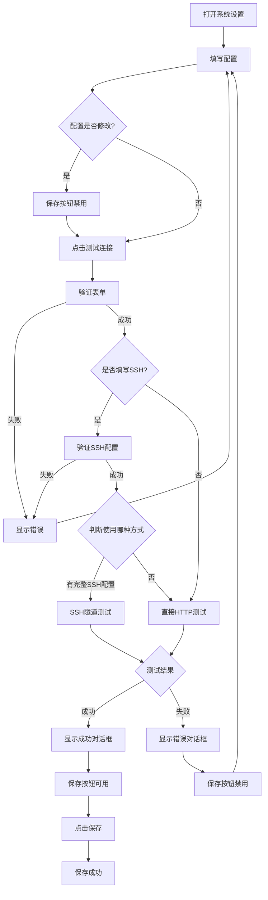

# 项目快速参考

## 项目信息

**项目名称**: lbdm (Electron + Vue 3)
**版本**: 1.0.0
**框架**: Electron, Vue 3, TypeScript, Vite

## 目录结构

```
lbdm/
├── src/
│   ├── main/              # 主进程
│   │   ├── config/        # 配置管理
│   │   ├── services/      # 业务服务
│   │   ├── ipc/           # IPC 处理器
│   │   ├── managers/      # 窗口/线程管理
│   │   └── index.ts       # 主入口
│   ├── renderer/          # 渲染进程
│   │   └── src/
│   │       ├── views/     # 页面组件
│   │       ├── stores/    # 状态管理
│   │       └── components/ # UI 组件
│   ├── preload/           # Preload 脚本
│   └── shared/            # 共享类型定义
│       └── ipc/           # IPC 类型
├── docs/                  # 文档目录
└── config.dev.json        # 开发环境配置（需创建）
```

## 常用命令

### 开发

```bash
npm run dev              # 启动开发服务器
npm run dev:electron     # 仅启动 Electron (需先运行 dev)
```

### 构建

```bash
npm run build            # 构建项目
npm run build:win        # 构建 Windows 版本
npm run build:mac        # 构建 macOS 版本
npm run build:linux      # 构建 Linux 版本
```

### 代码质量

```bash
npm run typecheck        # TypeScript 类型检查
npm run lint             # ESLint 检查
npm run format           # Prettier 格式化
```

## 核心功能

### 1. 配置管理

**位置**: `src/main/config/configManager.ts`

**接口**:

```typescript
interface SystemConfig {
  api: {
    apiUrl: string // API 地址（必填）
    testApiUrl: string // 测试接口地址
  }
  ssh: {
    server: string // SSH 服务器地址
    port: number // SSH 端口（默认 22）
    user: string // SSH 用户名
    password: string // SSH 密码
    useSshKey: boolean // 是否使用 SSH Key
    privateKey?: string // SSH 私钥内容或路径
  }
}
```

**配置文件位置**:

- 开发环境: `项目根目录/config.dev.json`
- 生产环境: `用户数据目录/config.json`

### 2. 测试连接功能

**位置**: `src/main/services/connectionTestService.ts`

**功能**:

- ✅ 直接 HTTP 请求测试
- ✅ SSH 隧道测试（自动判断）
- ✅ 响应时间统计
- ✅ 详细错误信息

**使用**:

```typescript
// 渲染进程
const result = await window.api.config.testConnection(config)
```

### 3. IPC 通信

**通道定义**: `src/shared/ipc/channels.ts`

**可用 API**:

```typescript
// 配置管理
window.api.config.get()
window.api.config.save(config)
window.api.config.reset()
window.api.config.getPath()
window.api.config.testConnection(config)

// 对话框
window.api.dialog.openFile(options)
window.api.dialog.openFiles(options)
window.api.dialog.openDirectory(options)
window.api.dialog.saveFile(options)
window.api.dialog.showMessage(options)
```

## 验证规则

### API 配置

- `apiUrl`: **必填**，系统接口地址
- `testApiUrl`: 测试时必填，测试接口地址

### SSH 配置（条件验证）

- 如果填写了 `server`，则以下字段必填：
  - `port`: 端口号
  - `user`: 用户名
  - `password` **或** `privateKey`（二选一）

## 表单验证函数

**位置**: `src/renderer/src/views/Configuration.vue`

```typescript
validateApiUrl() // 验证 API 地址
validateTestApiUrl() // 验证测试接口地址
validateSshConfig() // 验证 SSH 配置（条件验证）
```

## 错误处理

### IPC 序列化错误

**问题**: Vue 响应式对象无法通过 IPC 传递

**解决**: 使用 `toRaw()` 转换

```typescript
import { toRaw } from 'vue'

// 传递配置前转换
await window.api.config.save(toRaw(config.value))
```

### SSH 连接错误

常见错误及解决方案：

| 错误信息              | 原因       | 解决方法               |
| --------------------- | ---------- | ---------------------- |
| Authentication failed | 认证失败   | 检查用户名、密码或私钥 |
| Connection timeout    | 连接超时   | 检查服务器地址和端口   |
| Connection refused    | 连接被拒绝 | 检查 SSH 服务是否启动  |
| Host unreachable      | 主机不可达 | 检查网络连接           |

## 开发环境配置

### 首次设置

1. 创建开发配置文件：

```bash
# macOS/Linux
cp config.dev.example.json config.dev.json

# Windows
copy config.dev.example.json config.dev.json
```

2. 编辑 `config.dev.json` 填入实际配置

3. 配置文件已被 Git 忽略，不会提交

### 配置示例

```json
{
  "api": {
    "apiUrl": "https://api.example.com",
    "testApiUrl": "https://api.example.com/ping"
  },
  "ssh": {
    "server": "192.168.1.100",
    "port": 22,
    "user": "admin",
    "password": "your-password",
    "useSshKey": false,
    "privateKey": ""
  }
}
```

## 类型安全

### 共享类型

所有 IPC 相关的类型定义在 `src/shared/ipc/types.ts`

**优势**:

- ✅ 主进程和渲染进程使用相同类型
- ✅ TypeScript 提供完整的类型检查
- ✅ IDE 智能提示

### 导入方式

```typescript
// 主进程
import type { SystemConfig } from '@shared/ipc'

// 渲染进程
import type { SystemConfig } from '@shared/ipc'
```

## 窗口管理

**位置**: `src/main/managers/windowManager.ts`

```typescript
// 创建窗口
await windowManager.create({
  type: WindowType.MAIN,
  width: 1200,
  height: 800
  // ...其他选项
})

// 查找窗口
const mainWindow = windowManager.findByType(WindowType.MAIN)

// 监听窗口事件
windowManager.on(WindowEvent.CLOSE, (window) => {
  console.log('Window closed:', window.id)
})
```

## 线程管理

**位置**: `src/main/managers/threadManager.ts`

```typescript
// 创建线程
const thread = await threadManager.create({
  type: ThreadType.CUSTOM,
  modulePath: join(__dirname, '../workers/my-worker.js')
  // ...其他选项
})

// 发送消息
thread.send({ type: 'PROCESS_DATA', data: someData })

// 监听消息
thread.on('message', (data) => {
  console.log('Received from thread:', data)
})
```

## UI 组件

基于 **shadcn/ui** + **Radix Vue**

**可用组件**:

- Button
- Input
- Card
- Checkbox
- Dialog
- Toast
- ...更多

**使用方式**:

```vue
<script setup lang="ts">
import { Button } from '@/components/ui/button'
import { Input } from '@/components/ui/input'
</script>

<template>
  <Button variant="default">点击</Button>
  <Input v-model="value" placeholder="输入..." />
</template>
```

## 测试连接流程



```

## 常见问题

### Q: IDE 显示找不到模块错误，但编译成功？

A: 这是 TypeScript 语言服务器的缓存问题。解决方法：

- 重启 TypeScript 服务器
- 重启 IDE
- 或直接忽略（不影响运行）

### Q: 配置文件在哪里？

A:

- 开发环境：项目根目录下的 `config.dev.json`
- 生产环境：用户数据目录下的 `config.json`

### Q: 如何调试主进程？

A: 在 VS Code 中使用 F5 启动调试，或在代码中添加 `console.log`

### Q: SSH 连接总是失败？

A: 检查：

1. SSH 服务器地址和端口是否正确
2. 用户名和密码是否正确
3. 如果使用密钥，检查密钥格式
4. 网络是否连通

## 文档索引

- [配置管理](./CONFIGURATION.md)
- [表单验证](./FORM_VALIDATION.md)
- [测试连接功能](./TEST_CONNECTION.md)
- [测试后才能保存](./FEATURE_TEST_BEFORE_SAVE.md)
- [SSH 隧道 HTTP 请求修复](./FIX_SSH_HTTP_REQUEST.md)
- [开发环境配置](./DEV_CONFIG.md)
- [IPC 通信](./IPC_MANAGEMENT.md)
- [窗口和线程管理](./MANAGERS.md)
- [文件恢复报告](./RECOVERY_REPORT.md)
- [问题排查](./TROUBLESHOOTING.md)

## 项目状态

✅ **类型检查**: 通过
✅ **构建**: 成功
✅ **功能**: 完整
✅ **文档**: 完善

最后更新：2025-10-23
```
