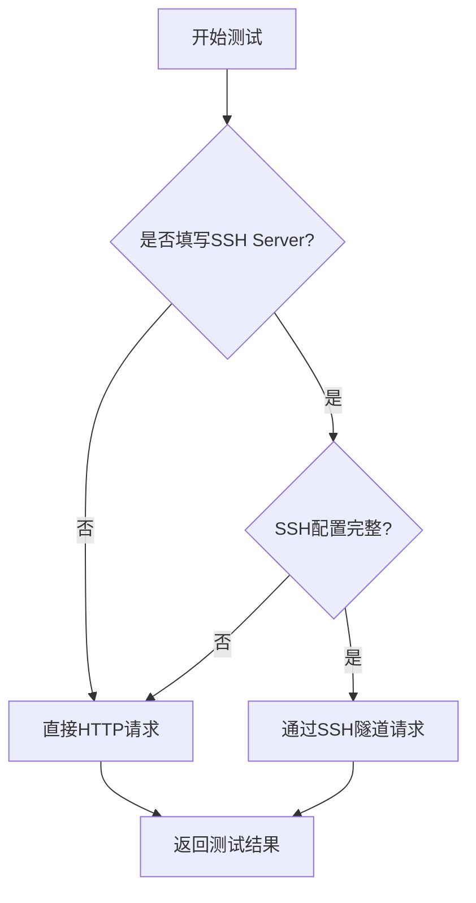

# 测试连接功能文档

## 功能概述

实现API接口连通性测试，支持直接HTTP请求和通过SSH隧道的代理请求。

---

## 功能特性

### 1. **智能连接方式选择**

- 自动检测SSH配置
- 有SSH配置时优先使用SSH隧道
- 无SSH配置时使用直接HTTP请求

### 2. **完整表单验证**

- 测试接口地址必填
- SSH配置完整性验证（如果填写了服务器）
- 实时错误提示

### 3. **详细测试结果**

- 响应状态码
- 响应时间（ms）
- 使用的连接方式
- 详细错误信息

---

## 使用流程

### 基本步骤

1. **填写配置**
   - 填写测试接口地址（必填）
   - 可选填写SSH配置

2. **点击测试连接**
   - 自动验证表单
   - 执行连接测试
   - 显示测试结果

3. **查看结果**
   - 成功：显示响应信息
   - 失败：显示错误详情

---

## 测试逻辑

### 验证规则

#### 必填项验证

```typescript
// 1. 测试接口地址必填
if (!config.api.testApi.trim()) {
  // 显示警告
}

// 2. 如果配置了SSH，验证SSH配置
if (config.ssh.server.trim()) {
  // 验证端口、用户名、认证方式
}
```

#### SSH配置验证

- Server不为空时：
  - Port必填
  - User必填
  - Password或SSH Key二选一

### 连接方式选择



---

## 技术实现

### 架构设计

```
┌─────────────────────────────────────────┐
│         渲染进程 (Renderer)              │
│  Configuration.vue                      │
│  - 表单验证                              │
│  - 调用testConnection API               │
│  - 显示测试结果                          │
└──────────────┬──────────────────────────┘
               │ IPC (传递当前表单配置)
               │
┌──────────────▼──────────────────────────┐
│         Preload 层                       │
│  安全的 API 接口                         │
└──────────────┬──────────────────────────┘
               │ IPC
               │
┌──────────────▼──────────────────────────┐
│         主进程 (Main)                    │
│  connectionTestService                  │
│  - 判断连接方式                          │
│  - 执行HTTP/SSH测试                      │
│  - 返回测试结果                          │
└─────────────────────────────────────────┘
```

### 核心文件

#### 1. 类型定义 (`src/shared/ipc/types.ts`)

```typescript
export interface ConnectionTestResult {
  success: boolean // 是否成功
  statusCode?: number // HTTP状态码
  responseTime?: number // 响应时间(ms)
  error?: string // 错误信息
  usedSsh?: boolean // 是否使用SSH
  details?: string // 详细信息
}
```

#### 2. 测试服务 (`src/main/services/connectionTestService.ts`)

主要方法：

- `testConnection()` - 主入口
- `shouldUseSsh()` - 判断是否使用SSH
- `testDirectHTTP()` - 直接HTTP测试
- `testViaSSH()` - SSH隧道测试

#### 3. IPC处理器 (`src/main/ipc/handlers.ts`)

```typescript
ipcMain.handle(IPC_CHANNELS.TEST_CONNECTION, async (_, config: SystemConfig) => {
  return await connectionTestService.testConnection(config)
})
```

#### 4. 前端调用 (`src/renderer/src/views/Configuration.vue`)

```typescript
const result = await window.api.config.testConnection(
  toRaw(config.value) // 传递当前表单配置（未保存）
)
```

---

## 测试场景

### 场景1: 直接HTTP测试（无SSH）

**配置**:

```json
{
  "api": {
    "testApi": "https://api.example.com"
  },
  "ssh": {
    "server": "" // 未填写
  }
}
```

**流程**:

1. 验证测试接口地址
2. 使用axios直接请求
3. 返回结果

**结果示例**:

```
响应状态: 200
响应时间: 145ms
直接连接
连接成功
```

### 场景2: 通过SSH隧道测试

**配置**:

```json
{
  "api": {
    "testApi": "http://internal-api.local"
  },
  "ssh": {
    "server": "192.168.1.100",
    "port": 22,
    "user": "admin",
    "password": "password"
  }
}
```

**流程**:

1. 验证测试接口地址和SSH配置
2. 建立SSH连接
3. 创建端口转发
4. 通过隧道发送HTTP请求
5. 返回结果

**结果示例**:

```
响应状态: 200
响应时间: 2350ms
使用 SSH 隧道
通过SSH隧道连接成功
```

### 场景3: 验证失败

**情况1: 未填写测试接口地址**

```
[警告] 验证失败
请填写测试接口地址
```

**情况2: SSH配置不完整**

```
[警告] 验证失败
请完善 SSH 配置信息
```

### 场景4: 连接失败

**HTTP请求失败**:

```
[错误] 连接失败
HTTP请求失败: connect ECONNREFUSED
连接被拒绝，请检查URL和端口是否正确
耗时: 5023ms
```

**SSH连接失败**:

```
[错误] 连接失败
SSH连接失败: All configured authentication methods failed
SSH认证失败，请检查用户名、密码或私钥
耗时: 3156ms
尝试使用了 SSH 隧道
```

---

## API参考

### 前端API

#### `window.api.config.testConnection(config)`

测试连接。

**参数**:

- `config: SystemConfig` - 当前表单配置（未保存）

**返回**: `Promise<ConnectionTestResult>`

**示例**:

```typescript
const result = await window.api.config.testConnection(toRaw(config.value))

if (result.success) {
  console.log('测试成功')
  console.log('状态码:', result.statusCode)
  console.log('响应时间:', result.responseTime)
} else {
  console.error('测试失败:', result.error)
}
```

### 后端服务

#### `ConnectionTestService.testConnection(config)`

执行连接测试。

**流程**:

1. 判断连接方式
2. 执行相应测试
3. 返回结果

**错误处理**:

- HTTP错误详情
- SSH错误详情
- 超时处理

---

## 错误处理

### HTTP错误

| 错误码       | 说明         | 处理方式         |
| ------------ | ------------ | ---------------- |
| ECONNREFUSED | 连接被拒绝   | 检查URL和端口    |
| ETIMEDOUT    | 连接超时     | 检查网络连接     |
| ENOTFOUND    | 域名解析失败 | 检查URL正确性    |
| 4xx/5xx      | HTTP错误     | 显示状态码和描述 |

### SSH错误

| 错误类型              | 说明       | 处理方式            |
| --------------------- | ---------- | ------------------- |
| Authentication failed | 认证失败   | 检查用户名密码/密钥 |
| Connection timeout    | 连接超时   | 检查服务器地址端口  |
| Connection refused    | 连接被拒绝 | 检查SSH服务状态     |
| Host not found        | 主机未找到 | 检查服务器地址      |

---

## 性能优化

### 超时设置

```typescript
// HTTP请求超时
axios.get(url, {
  timeout: 10000 // 10秒
})

// SSH连接超时
{
  readyTimeout: 10000 // 10秒
}
```

### 资源管理

- SSH连接自动关闭
- HTTP请求取消机制
- 内存泄漏防护

---

## 安全考虑

### 1. 配置数据安全

- 使用`toRaw()`避免响应式对象序列化错误
- 密码和私钥不打印到日志
- SSH私钥支持文件路径和内容两种方式

### 2. SSH连接安全

- 支持密码和密钥认证
- 支持私钥passphrase
- 连接超时保护

### 3. 网络安全

- 不验证SSL证书（可配置）
- 支持代理配置
- 请求头安全设置

---

## 最佳实践

### 1. 测试前验证

```typescript
// 先验证必填项
if (!validatetestApi()) return

// 再验证SSH配置（如果有）
if (config.ssh.server.trim()) {
  if (!validateSshConfig()) return
}
```

### 2. 错误信息友好化

```typescript
// 提供详细但易懂的错误信息
{
  error: '连接被拒绝',
  details: '请检查URL和端口是否正确'
}
```

### 3. 响应时间展示

```typescript
// 始终显示响应时间
responseTime: Date.now() - startTime
```

---

## 调试建议

### 1. 日志输出

开发环境下查看控制台日志：

- SSH连接状态
- HTTP请求详情
- 错误堆栈

### 2. 测试工具

- 使用curl验证HTTP接口
- 使用ssh命令验证SSH连接
- 使用tcpdump抓包分析

### 3. 常见问题

**问题1: SSH连接慢**

- 检查DNS解析
- 检查SSH服务配置
- 增加超时时间

**问题2: HTTP请求失败**

- 检查防火墙
- 检查代理设置
- 验证URL格式

---

## 相关文档

- [配置管理文档](./CONFIGURATION.md)
- [表单验证文档](./FORM_VALIDATION.md)
- [SSH配置文档](./SSH_CONFIGURATION.md)

---

**创建日期**: 2025-10-23
**维护者**: 开发团队
**状态**: ✅ 已实现
